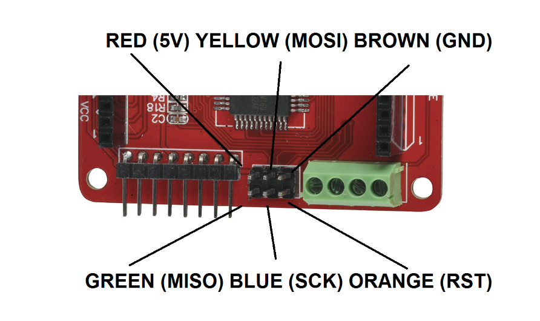

# RGB Matrix Clock

The new ZD1810 RGB LED matrixes make an awesome display, and can in fact be driven by the XC4498 RGB LED Driver Board. What's cool about the XC4498 RGB LED Driver Board is that it has a ATMega328 IC on board, so it can actually be used as a controller board. You might notice that the XC4498 doesn't have a USB port, so it's not quite the same as an Uno, but if you have a spare Uno lying around, this can be purposed temporarily as a programmer. We'll also show you how to connect a USB-Serial converter to the board so that it can be used more like an Uno.

## Shopping List

|Qty| Code | Description |
|---|---|---|
|1 | [XC4498](http://jaycar.com.au/p/XC4498) | RGB LED Driver
|1 | [ZD1810](http://jaycar.com.au/p/ZD1810) | RGB Matrix
|1 | [WC6028](http://jaycar.com.au/p/WC6028) | Plug-socket leads
|1 | [XC4450](http://jaycar.com.au/p/XC4450) | RTC Module

You will also need something to program the board- either an Arduino main board like the

[XC4410 Uno](https://jaycar.com.au/p/XC4410) , or the [XC4627 ISP programmer](https://jaycar.com.au/p/XC4627) . We’ll also show later how to connect the [XC4464 USB-Serial Converter](https://jaycar.com.au/p/XC4464) .

## Looking at the XC4498:

The XC4498 is a board designed to drive 64 RGB LEDs, and can be used with either the ZD1810 RGB LED Matrix or the XC4624 RGB Cube. When powered up, it is preprogrammed with a 'plasma' pattern of various swirling colours. To connect the XC4498 to the ZD1810, look for the '1' pin marking on the ZD1810, and make sure that it plugs into the Blue 1 pin on the XC4498. It won't do any damage if it plugs in the wrong way, but the display won't look right. If in doubt, try it one way, and if the display isn't right, try spinning the display 180 degrees.

The XC4498 has many headers, but what we are most interested in is the ISP header, which will be used to upload sketches, and also the Power/Serial/I2C header which can be used for providing power while the display is connected (as it blocks the ISP header).

## Programming:

If you are using an ISP programmer, you can jump ahead to the section after the wiring is done. To set up an Uno as an ISP programmer, firstly we need to program the Uno to behave as a programmer. This is done by uploading the ArduinoISP sketch `File->Example->11.ArduinoISP->ArduinoISP`, then connecting the Uno to the XC4498 with six jumper wires. There's also a seventh jumper wire on the Uno which is used to keep the Uno itself from being programmed.

The connections are as follows:

|Uno|XC4498|Colour
|---|---|---
|5V|VCC|Red
|GND|GND|Brown
|SS(D10)|RST|Orange
|MOSI(D11)|MOSI|Yellow
|MISO(D12)|MISO|Green
|SCK(D13)|SCK|Blue
|RST to 5V on ISP header (bottom right)||Purple

After this wiring is complete, a good test is to burn a bootloader onto the board. Select 'Arduino as ISP' as bootloader `Tools->Programmer->Arduino as ISP`. The serial port remains the same as the connected Uno, and the board type should be Uno (but this is because the XC4498 has an ATMega328). Then click `Tools>Burn Bootloader`. If the Arduino IDE comes up 'Done burning bootloader', then everything is working fine. After the bootloader is burnt, you can leave the programmer attached to burn the main sketch, or the ISP programmer can be disconnected and a USB-Serial converter connected.

## Connecting a USB-Serial Converter:

Once a bootloader has been installed, the only thing stopping the XC4498 behaving like an Uno is the lack of a USB-Serial converter. If we connect an XC4464 USB-Serial converter, then we can program the matrix without having to remove the matrix to make programming connections.

Using five of the plug-socket jumper wires, make the following connections:

|XC4464 USB-Serial|XC4498 RGB matrix|Colour
|---|---|---
|GND|GND|Brown
|5V|VDD|Red
|TXD|RXD|Orange
|RXD|TXD|Yellow
|DTR|DTR|Green

## The Sketch:

The sketch for our RGB Matrix Clock uses a library called Colorduino to control the matrix. This doesn't appear to be available on the Library Manager, but can be downloaded from the Github page at

[https://github.com/lincomatic/Colorduino](https://github.com/lincomatic/Colorduino) .

For the Real Time Clock Module, you'll also need the 'RTClib' library, which can be installed through the Library Manager- search for 'rtclib', or alternatively, download from the Github page at

[https://github.com/adafruit/RTClib](https://github.com/adafruit/RTClib) .

Open the 'RGB_Matrix_Clock' sketch and upload it to the board, either using the USB-Serial converter as though it were a regular Uno, or via the ISP by pressing Ctrl-Shift-U. There isn't much to be customized, although the colours can be changed by altering the HOURS, MINUTES and SECONDS #defines to different RGB colour values.

If the display is connected, it should display some numbers like the below. It won't be the right time, because the Real Time Clock Module isn't connected.

To complete assembly, you will need to connect the Real Time Clock Module as follows:

|XC4498 RGB matrix|XC4450 Real Time Clock|Colour
|---|---|---
|VDD|VCC|White
|GND|GND|Black
|SCL|SCL|Purple
|SDA|SDA|Grey

And finally, make sure you have a way of feeding power into the project. The Real Time Clock Module has a second set of VCC/GND connections, so this can be used as the main power feed if this suits.

## Improvements:

A clock is just one thing that can make use of the RGB matrix, and the Colorduino library makes it easy to control individual pixels by colour.

One cool thing about the XC4498 RGB Matrix Driver is that the plugs on one side will fit into the sockets on the other side, allowing multiple displays to be daisy-chained and make larger displays, which could make for a much more legible clock display.
